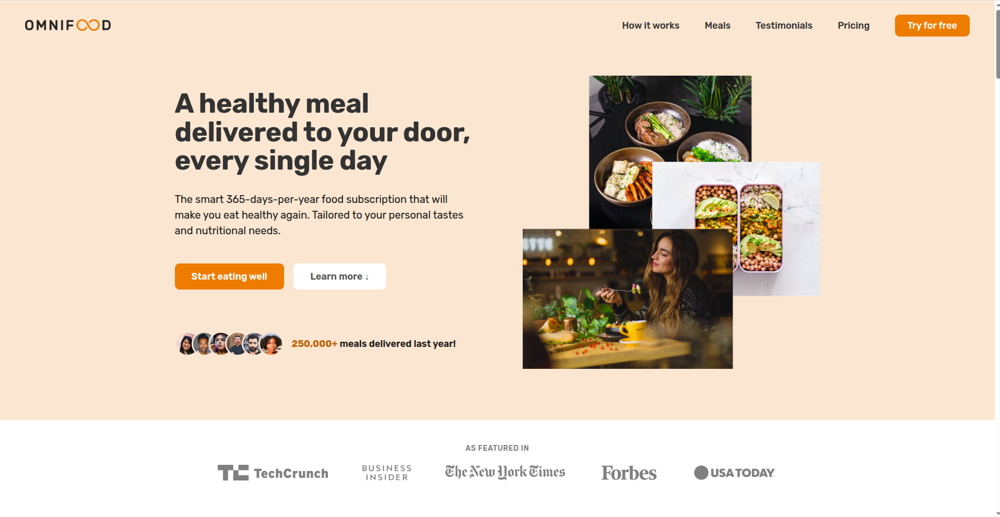

  

  
  
  

# OMNIFOOD: Udemy Project

We are a technology company first, but with a major focus on consumer well-being through a healthy diet. Most people are very busy with their jobs, family and friends, and other important activities, which doesn't leave much time for cooking. This might lead to a poor diet and lasting health consequences. We want to solve this problem by using an AI-centric approach. Users can use our app to select their diet and foods they like and dislike, and our AI algorithm will create a custom and individual weekly meal plan. But we don't stop there. We partner with restaurants and other cooking partners to actually cook and deliver all meals from the generated meal plans, in selected cities. All this will be packed up in a monthly subscription, where users can choose between receiving one or two meals per day, every single day of the month.

## Information

This repository is to record my learnings, hoping to help you understand the basics of HTML5 and Modern CSS, especially in SEO, Accessibility, and Modern CSS Layout. All the code here is learning material from the HTML and CSS course I took on Udemy which was created by [Jonas Schmedtmann](https://github.com/jonasschmedtmann).

- [Build Responsive Real-World Websites with HTML and CSS](https://www.udemy.com/course/design-and-develop-a-killer-website-with-html5-and-css3/?couponCode=KEEPLEARNING)

### Things I learned

- SEO HTML5
- Accessibility HTML5
- Reusable Modern CSS layout: Flexbox and Grid
- Responsive design with rem / em and media query

### Screenshot of website

## Thanks 🤝

This repository is purely intended as a learning template and a place to store educational materials. It does not claim ownership of the project, design, or any related assets.
